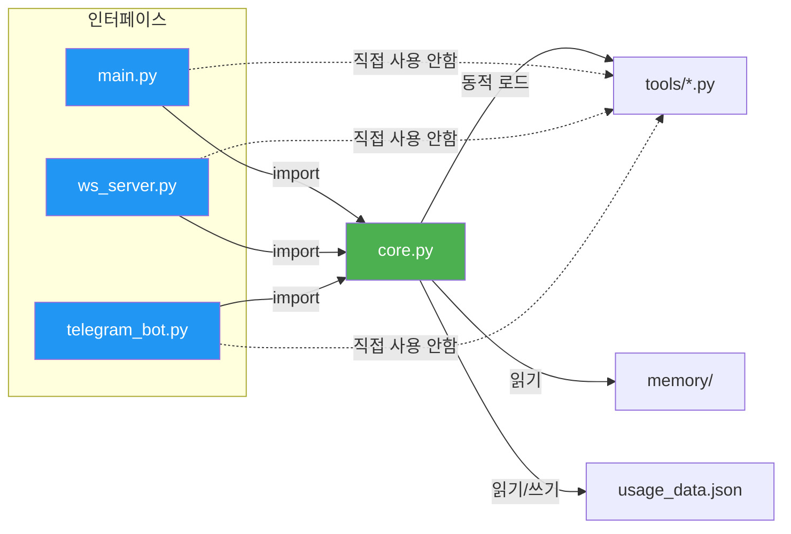

# flux-openclaw 아키텍처

## 프로젝트 개요

flux-openclaw는 Claude API 기반의 **자기 확장형 AI 에이전트**입니다. AI가 대화 중 새로운 도구를 직접 만들어 사용할 수 있으며, CLI/WebSocket/Telegram 세 가지 인터페이스를 제공합니다. OpenClaw의 보안 취약점을 분석하여 심층 방어 구조를 적용한 보안 최우선 설계입니다.

---

## 시스템 아키텍처

```mermaid
graph TB
    subgraph "인터페이스 레이어"
        CLI["main.py<br/>CLI 인터페이스"]
        WS["ws_server.py<br/>WebSocket 서버"]
        TG["telegram_bot.py<br/>Telegram 봇"]
        DC["discord_bot.py<br/>Discord 봇"]
        SL["slack_bot.py<br/>Slack 봇"]
    end

    subgraph "백그라운드 서비스"
        DAEMON["daemon.py<br/>데몬 프로세스 매니저"]
        SCHED["scheduler.py<br/>스케줄러 시스템"]
    end

    subgraph "코어 엔진"
        CORE["core.py<br/>공유 엔진"]
        TM["ToolManager<br/>도구 관리자"]
        SP["load_system_prompt<br/>프롬프트 로더"]
        UT["Usage Tracking<br/>사용량 추적"]
        FT["_filter_tool_input<br/>입력 필터링"]
        SEC["Security Scanner<br/>위험 패턴 탐지"]
        MEMSTORE["memory_store.py<br/>구조화된 메모리"]
        LLM["llm_provider.py<br/>LLM Provider"]
        MKENG["tool_marketplace.py<br/>도구 마켓플레이스"]
        ONBOARD["onboarding.py<br/>온보딩 마법사"]
        DASH["dashboard.py<br/>웹 대시보드"]
        KB["knowledge_base.py<br/>지식 베이스"]
        SDK["plugin_sdk.py<br/>플러그인 SDK"]
        CE["conversation_engine.py<br/>대화 엔진"]
        RES["resilience.py<br/>복원력"]
        CFG["config.py<br/>중앙 설정"]
        LOGCFG["logging_config.py<br/>구조화된 로깅"]
        HEALTH["health.py<br/>헬스체크"]
    end

    subgraph "도구 레이어"
        TOOLS["tools/<br/>플러그인 디렉토리"]
        WEB["web_search.py"]
        FETCH["web_fetch.py"]
        WEATHER["weather.py"]
        FILE_R["read_text_file.py"]
        FILE_W["save_text_file.py"]
        FILES["list_files.py"]
        AUDIO["play_audio.py"]
        SCREEN["screen_capture.py"]
        MATH["add/multiply.py"]
        MEMMGR["memory_manage.py"]
        SCHEDTOOL["schedule_task.py"]
        MKTOOL["marketplace_tool.py"]
        BROWSER["browser_tool.py"]
        KBTOOL["knowledge_tool.py"]
    end

    subgraph "영속성 레이어"
        MEM["memory/<br/>시스템 프롬프트 + 메모리"]
        HIST["history/<br/>대화 기록"]
        USAGE["usage_data.json<br/>API 사용량"]
        APPROVED[".tool_approved.json<br/>도구 승인 해시"]
        MEMDB["memory/memory.db<br/>SQLite 메모리 저장소"]
        SCHEDDB["scheduler/tasks.db<br/>예약 작업 저장소"]
        MKREG["marketplace/registry.json<br/>도구 카탈로그"]
        MKINSTALL["marketplace/installed.json<br/>설치 추적"]
        KBIDX["knowledge/index.json<br/>TF-IDF 인덱스"]
        KBDOCS["knowledge/docs/<br/>지식 문서"]
    end

    subgraph "외부 서비스"
        CLAUDE["Anthropic Claude API"]
        OPENAI["OpenAI API"]
        GOOGLE["Google Gemini API"]
        DDG["DuckDuckGo"]
        WTTR["wttr.in"]
        URLS["외부 웹사이트"]
        TGAPI["Telegram API"]
        DCAPI["Discord API"]
        SLAPI["Slack API"]
    end

    CLI --> CE
    WS --> CE
    TG --> CE
    DC --> CE
    SL --> CE
    DAEMON --> SCHED

    CE --> CORE
    CE --> RES
    CE --> CFG
    CORE --> TM
    CORE --> SP
    CORE --> UT
    CORE --> FT
    CORE --> MEMSTORE
    CORE --> LLM
    CORE --> RES
    CORE --> CFG
    CORE --> LOGCFG
    TM --> SEC
    SCHED --> CORE
    DAEMON --> HEALTH

    TM --> TOOLS
    TOOLS --> WEB
    TOOLS --> FETCH
    TOOLS --> WEATHER
    TOOLS --> FILE_R
    TOOLS --> FILE_W
    TOOLS --> FILES
    TOOLS --> AUDIO
    TOOLS --> SCREEN
    TOOLS --> MATH
    TOOLS --> MEMMGR
    TOOLS --> SCHEDTOOL
    TOOLS --> MKTOOL
    TOOLS --> BROWSER

    SP --> MEM
    CLI --> HIST
    UT --> USAGE
    TM --> APPROVED
    MEMSTORE --> MEMDB
    MEMMGR --> MEMSTORE
    SCHEDTOOL --> SCHED
    SCHED --> SCHEDDB
    MKTOOL --> MKENG
    MKENG --> MKREG
    MKENG --> MKINSTALL

    LLM --> CLAUDE
    LLM --> OPENAI
    LLM --> GOOGLE

    WEB --> DDG
    FETCH --> URLS
    WEATHER --> WTTR
    TG --> TGAPI
    DC --> DCAPI
    SL --> SLAPI

    DASH --> CORE
    DASH --> MEMSTORE
    DASH --> SCHED
    DASH --> KB
    DASH --> MKENG
    KB --> KBIDX
    KB --> KBDOCS
    KBTOOL --> KB
    TOOLS --> KBTOOL
    SP --> KB
```



---

## 의존성 방향 (정확한 방향)



> **핵심**: 모든 인터페이스는 `core.py`만 import합니다. `tools/`는 `ToolManager`를 통해서만 접근됩니다. 인터페이스 간에는 의존성이 없습니다.

---

## 레이어별 상세 설명

### 1. 인터페이스 레이어

각 인터페이스는 **독립적인 진입점**입니다. 서로 import하지 않으며, 모두 `core.py`에서 공유 로직을 가져옵니다.

| 파일 | 역할 | 고유 기능 |
|------|------|----------|
| `main.py` | CLI 대화 에이전트 | 대화 복원, 세션 저장, 실시간 토큰 표시 |
| `ws_server.py` | WebSocket 서버 | Origin 검증, 토큰 인증, 비동기 처리, Rate Limiting |
| `telegram_bot.py` | Telegram 봇 | 사용자 허용목록, 도구 제한, 명령어 핸들러 |
| `discord_bot.py` | Discord 봇 | 채널 기반 대화, 슬래시 커맨드, 임베드 메시지 |
| `slack_bot.py` | Slack 봇 | 워크스페이스 통합, 스레드 대화, 멘션 처리 |

### 2. 백그라운드 서비스

#### 데몬 프로세스 매니저 (`daemon.py`)

백그라운드 서비스를 관리하는 시스템 데몬입니다.

| 기능 | 설명 |
|------|------|
| **프로세스 관리** | 스케줄러 프로세스의 시작/중지/재시작 |
| **PID 파일 관리** | `scheduler/scheduler.pid`를 통한 프로세스 추적 |
| **상태 확인** | 실행 중인 서비스의 상태 모니터링 |
| **자동 재시작** | 크래시 시 자동 복구 (옵션) |

#### 스케줄러 시스템 (`scheduler.py`)

cron 스타일의 예약 작업 시스템입니다.

| 컴포넌트 | 역할 |
|----------|------|
| **TaskScheduler** | 작업 스케줄링 엔진, SQLite 기반 영속성 |
| **실행 모드** | 일회성(once) 및 반복(recurring) 작업 지원 |
| **cron 파싱** | 5필드 cron 표현식 지원 (분 시 일 월 요일) |
| **실행 이력** | 작업 실행 기록 저장 및 조회 |
| **에러 처리** | 실패한 작업 로깅 및 재시도 로직 |

**데이터베이스 스키마:**
- `tasks`: 예약 작업 정의 (id, name, schedule_type, cron/datetime, action, enabled)
- `executions`: 실행 이력 (task_id, executed_at, success, result)

### 3. 코어 엔진 (`core.py`)

모든 인터페이스가 공유하는 핵심 로직:

| 컴포넌트 | 함수/클래스 | 역할 |
|----------|------------|------|
| **ToolManager** | `ToolManager` | 도구 검색, 보안 검사, 로드, 핫리로드 |
| **보안 스캐너** | `_check_dangerous`, `_check_dangerous_ast` | Regex + AST 기반 위험 코드 탐지 |
| **입력 필터링** | `_filter_tool_input` | 스키마 기반 입력 검증 + 타입 체크 |
| **프롬프트** | `load_system_prompt` | instruction.md + memory.md 통합 로딩 |
| **사용량** | `load_usage`, `save_usage`, `check_daily_limit`, `increment_usage` | 일일 API 호출 추적 (파일 잠금) |
| **마스킹** | `_mask_secrets` | API 키 자동 [REDACTED] 처리 |
| **실행** | `execute_tool` | 도구 호출 실행 + 결과 포맷팅 |
| **LLM Provider** | `llm_provider.py` | 멀티 LLM 지원 (Anthropic, OpenAI, Google) |

#### 구조화된 메모리 시스템 (`memory_store.py`)

SQLite 기반의 체계적인 메모리 관리 시스템입니다.

| 기능 | 설명 |
|------|------|
| **카테고리 관리** | user_info, preferences, facts, notes, reminders |
| **중요도 시스템** | 1-5 레벨, 높은 중요도 우선 조회 |
| **검색 기능** | 키워드 기반 전문 검색 (FTS5) |
| **자동 요약** | 프롬프트에 포함될 메모리 요약 생성 |
| **타임스탬프** | 생성/수정 시간 자동 기록 |

**데이터베이스 스키마:**
- `memories`: 메모리 저장소 (id, category, key, value, importance, created_at, updated_at)
- `memories_fts`: 전문 검색 인덱스 (FTS5)

### 4. 도구 레이어 (`tools/`)

각 도구는 **독립적인 단일 파일**입니다. 3가지 규약을 따릅니다:

```python
SCHEMA = { ... }      # Claude API 함수 스키마
def main(**kwargs):    # 실행 로직
    ...
if __name__ == "__main__":  # 단독 테스트
    ...
```

| 도구 | 보안 기능 |
|------|----------|
| `web_fetch.py` | SSRF 방어 (DNS 핀닝, 프라이빗 IP 차단, 리다이렉트 검증) |
| `read_text_file.py` | 경로 탈출 방지, 심볼릭 링크 차단, 차단 파일/디렉토리, API 키 마스킹 |
| `save_text_file.py` | 보호 파일/디렉토리, 크기 제한, O_NOFOLLOW, 덮어쓰기 확인 |
| `weather.py` | 입력 화이트리스트 (도시 이름 검증) |
| `web_search.py` | 검색 결과 수 제한 (최대 20) |
| `memory_manage.py` | 메모리 CRUD 인터페이스 (save, search, list, delete) |
| `schedule_task.py` | 예약 작업 관리 인터페이스 (add, list, remove, history) |
| `marketplace_tool.py` | 7계층 보안 방어 (해시검증, regex, AST, 규약검증, 예약이름 차단) |
| `browser_tool.py` | SSRF 방어 (프라이빗 IP 차단, 위험 스킴 차단), Playwright 폴백 |
| `knowledge_tool.py` | 지식 베이스 검색/추가/삭제/목록/통계 인터페이스 |

### 5. 영속성 레이어

| 파일 | 용도 | 접근 방식 |
|------|------|----------|
| `memory/instruction.md` | AI 시스템 프롬프트 | 시작 시 읽기 전용 |
| `memory/memory.md` | AI 영속 메모리 (레거시) | 도구를 통해 읽기/쓰기 |
| `memory/memory.db` | 구조화된 메모리 저장소 | SQLite, FTS5 전문 검색 |
| `scheduler/tasks.db` | 예약 작업 데이터베이스 | SQLite, 작업 및 실행 이력 |
| `scheduler/scheduler.pid` | 스케줄러 PID 파일 | 데몬 프로세스 추적 |
| `history/` | 대화 기록 (CLI 전용) | 세션 종료 시 저장, 시작 시 복원 |
| `usage_data.json` | 일일 API 사용량 | 파일 잠금(`fcntl`)으로 원자적 접근 |
| `.tool_approved.json` | 도구 승인 해시 | SHA-256 해시 기반 승인 상태 |
| `marketplace/registry.json` | 도구 카탈로그 | 읽기 전용 (시스템 관리) |
| `marketplace/installed.json` | 설치 추적 | fcntl 잠금으로 원자적 접근 |
| `marketplace/cache/` | 설치 가능 도구 소스 | 읽기 전용 |
| `knowledge/index.json` | TF-IDF 인덱스 | fcntl 잠금으로 원자적 접근 |
| `knowledge/docs/` | 지식 문서 저장소 | JSON 파일 기반 |

---

## Phase 4 컴포넌트

### 도구 마켓플레이스 (`tool_marketplace.py`)

커뮤니티 도구 공유/설치 시스템입니다.

| 기능 | 설명 |
|------|------|
| **검색** | 이름, 카테고리, 태그별 도구 검색 |
| **설치** | 7계층 보안 검증 후 tools/ 에 설치 |
| **제거** | 설치된 도구 안전 제거 |
| **무결성 검증** | SHA-256 해시 기반 변조 탐지 |
| **로컬 카탈로그** | 10개 사전 패키징 도구 (utility, data 카테고리) |

**7계층 보안 방어:**
1. 파일명 검증 (^[a-zA-Z0-9_]+\.py$)
2. 예약 이름 충돌 방지 (기존 도구 보호)
3. SHA-256 해시 검증 (레지스트리 vs 캐시 파일)
4. Regex 보안 스캔 (core.py _DANGEROUS_RE)
5. AST 보안 스캔 (core.py _check_dangerous_ast)
6. 도구 규약 검증 (SCHEMA + main() 필수)
7. ToolManager 재검사 (설치 후 기존 승인 플로우)

**사전 패키징 도구 (10개):**
unit_converter, json_formatter, text_translator, csv_parser, timer, random_generator, base_converter, text_stats, color_converter, hash_generator

### 브라우저 자동화 (`tools/browser_tool.py`)

AI가 웹 브라우저를 제어하는 도구입니다.

| 기능 | 설명 |
|------|------|
| **navigate** | URL 이동 + 페이지 텍스트 추출 |
| **click** | CSS 선택자로 요소 클릭 (Playwright 필요) |
| **type_text** | 텍스트 입력 (Playwright 필요) |
| **get_text** | 페이지/요소 텍스트 추출 |
| **screenshot** | 스크린샷 캡처 (Playwright 필요) |
| **get_links** | 페이지 링크 목록 추출 |
| **wait** | 지정 시간 대기 (최대 10초) |
| **scroll** | 페이지 스크롤 (Playwright 필요) |

**보안:**
- SSRF 방어 (프라이빗 IP 차단, DNS 해석 검증)
- 위험 스킴 차단 (file://, javascript:, data: 등)
- 타임아웃 30초, 응답 크기 50,000자 제한
- JavaScript 실행 API 미제공

**폴백 모드:**
Playwright 미설치 시 requests + BeautifulSoup으로 navigate, get_text, get_links 지원

### 온보딩 시스템 (`onboarding.py`)

새 사용자를 위한 대화형 CLI 설정 마법사입니다.

| 기능 | 설명 |
|------|------|
| **API 키 설정** | getpass 마스킹, 형식 검증 (최대 3회 재시도) |
| **인터페이스 안내** | CLI/WebSocket/Telegram/Discord/Slack 설정 |
| **LLM 프로바이더** | Anthropic/OpenAI/Google 선택 |
| **.env 파일 생성** | 0o600 퍼미션, O_NOFOLLOW, 자동 백업 |

---

## Phase 5 컴포넌트

### 웹 대시보드 (`dashboard.py`)

관리자용 웹 기반 대시보드입니다. stdlib http.server 기반으로 외부 의존성 없이 동작합니다.

| 기능 | 설명 |
|------|------|
| **상태 모니터링** | 시스템 상태, 서비스 현황, 도구 목록 실시간 조회 |
| **메모리 관리** | 메모리 CRUD (추가, 조회, 삭제) |
| **스케줄 관리** | 예약 작업 조회, 추가, 삭제 |
| **지식 베이스** | 문서 추가, 검색, 통계 조회 |
| **사용량 통계** | 일일 API 호출수, 토큰 사용량 시각화 |
| **마켓플레이스** | 도구 설치/제거 |

**보안:**
- Bearer 토큰 인증 (DASHBOARD_TOKEN 환경변수, hmac.compare_digest)
- 127.0.0.1 바인딩 (로컬 전용)
- 경로 탈출 방지 (os.path.realpath)
- 1MB 요청 본문 제한
- CORS 비활성

**정적 파일:**
- `dashboard/index.html` — SPA 관리자 UI
- `dashboard/style.css` — 다크 테마 스타일시트
- `dashboard/app.js` — 클라이언트 사이드 로직

### RAG 지식 베이스 (`knowledge_base.py`)

TF-IDF 기반 문서 검색 시스템입니다. 외부 의존성 없이 순수 Python stdlib로 구현됩니다.

| 기능 | 설명 |
|------|------|
| **문서 인덱싱** | 텍스트/마크다운 파일 인덱싱, 청크 분할 |
| **TF-IDF 검색** | Term Frequency-Inverse Document Frequency 기반 검색 |
| **한국어 지원** | 한국어 regex 토크나이저, 조사 제거 |
| **AI 컨텍스트** | 검색 결과를 시스템 프롬프트에 주입 (1000자 예산) |
| **디렉토리 인덱싱** | 폴더 전체 일괄 인덱싱 |

**TF-IDF 구현:**
- 토크나이저: `re.findall(r'[a-zA-Z가-힣0-9]+', text.lower())`
- TF: `collections.Counter(tokens)` / len(tokens)
- IDF: `math.log((N+1) / (1 + df))`
- 코사인 유사도: 벡터 내적 / (L2 노름 곱)
- 청크 분할: 단락 기준, 최대 500자

**저장소:**
- `knowledge/docs/{uuid}.json` — 문서 + 청크 데이터
- `knowledge/index.json` — TF-IDF 역 인덱스

### 플러그인 SDK (`plugin_sdk.py`)

도구 개발을 위한 CLI 도구입니다.

| 서브커맨드 | 설명 |
|-----------|------|
| `new <name>` | 도구 템플릿 생성 (SCHEMA + main 함수) |
| `check <file>` | 보안 검사 (regex + AST, core.py 패턴 재사용) |
| `test <file>` | 자동 테스트 (SCHEMA 검증 + main 실행) |
| `package <file>` | 마켓플레이스 등록 준비 (SHA-256 해시, registry entry) |

**보안 검사:**
core.py의 `_DANGEROUS_RE` + `ToolManager._check_dangerous_ast`를 재사용하여 동일한 보안 수준 적용

---

## 데이터 흐름

### CLI 모드 (`main.py`)

```
사용자 입력 → 일일 한도 확인 → 도구 변경 감지
    → Claude API 호출 → 응답 파싱
    → [도구 호출 필요?]
        → Yes: 입력 필터링 → 도구 실행 → 결과 반환 → Claude에 전달 (최대 10회 반복)
        → No: 텍스트 응답 출력
    → 사용량 기록 → 토큰 표시
```

### WebSocket 모드 (`ws_server.py`)

```
WebSocket 연결 요청
    → Origin 검증 → 토큰 인증 → 동시 연결 제한 확인
    → 메시지 수신
        → Rate Limit 확인 → JSON 파싱
        → 일일 한도 확인 → Claude API 호출 (비동기)
        → 도구 실행 (asyncio.to_thread)
        → JSON 응답 전송 (비밀 마스킹)
```

### Telegram 모드 (`telegram_bot.py`)

```
Telegram 메시지 수신
    → 허용 사용자 확인 → Rate Limit 확인
    → 일일 한도 확인 → Claude API 호출
    → [도구 호출?]
        → 제한된 도구 차단
        → 허용된 도구 실행 (asyncio.to_thread)
    → 응답 전송 (4000자 분할)
```

---

## 파일별 수정 가이드

### 새 도구 추가하기

`tools/` 폴더에 `.py` 파일을 추가하세요. 재시작 없이 자동 인식됩니다.

```python
# tools/my_tool.py
SCHEMA = {
    "name": "my_tool",
    "description": "도구 설명",
    "input_schema": {
        "type": "object",
        "properties": {
            "param": {"type": "string", "description": "매개변수"},
        },
        "required": ["param"],
    },
}

def main(param):
    return f"결과: {param}"

if __name__ == "__main__":
    print(main("test"))
```

### 새 인터페이스 추가하기

1. `core.py`에서 필요한 모듈을 import
2. Claude API 호출 루프 구현 (main.py 참고)
3. 인터페이스별 보안 설정 추가

```python
from core import (
    ToolManager, _filter_tool_input, _mask_secrets,
    load_system_prompt, load_usage, increment_usage,
    check_daily_limit, MAX_TOOL_ROUNDS,
)
```

### 수정 가능한 설정값

| 설정 | 위치 | 현재값 | 설명 |
|------|------|--------|------|
| 일일 API 호출 한도 | `core.py` `DEFAULT_MAX_DAILY_CALLS` | 100 | 전체 인터페이스 공유 |
| 도구 호출 최대 횟수 | `core.py` `MAX_TOOL_ROUNDS` | 10 | 한 턴당 도구 체인 제한 |
| 대화 히스토리 상한 | 각 인터페이스 | 50 | 메모리/비용 보호 |
| 메모리 크기 제한 | `core.py` `load_system_prompt` | 2000자 | 프롬프트 인젝션 표면 축소 |
| 응답 최대 토큰 | 각 인터페이스 | 4096 | Claude API max_tokens |
| AI 모델 | 각 인터페이스 | claude-sonnet-4-20250514 | 사용할 모델 |
| LLM_PROVIDER | 환경변수 `.env` | anthropic | 사용할 LLM (anthropic/openai/google) |
| LLM_MODEL | 환경변수 `.env` | - | 모델명 (미설정 시 프로바이더 기본값) |
| WS Rate Limit | `ws_server.py` | 30 msg/min | 분당 메시지 제한 |
| WS 동시 연결 | `ws_server.py` | 10 | 최대 연결 수 |
| TG Rate Limit | `telegram_bot.py` | 10 msg/min | 사용자별 제한 |
| 파일 크기 제한 | `save_text_file.py` | 1MB | 저장 파일 크기 |
| SSRF 응답 제한 | `web_fetch.py` | 5MB | 웹 페이지 크기 |
| 위험 패턴 목록 | `core.py` `_DANGEROUS_PATTERNS` | 30종 | 도구 보안 검사 |
| 차단 import 목록 | `core.py` `_check_dangerous_ast` | 25종 | AST 기반 검사 |
| 마켓플레이스 도구 수 | `tool_marketplace.py` `_RESERVED_NAMES` | (동적) | 설치 가능 도구 수는 무제한 |
| 브라우저 타임아웃 | `browser_tool.py` `_MAX_TIMEOUT` | 30초 | 페이지 로드 최대 시간 |
| 브라우저 응답 제한 | `browser_tool.py` `_MAX_RESPONSE_CHARS` | 50,000자 | 페이지 텍스트 최대 크기 |

### 보안 설정 수정 시 주의사항

| 수정 대상 | 위험도 | 주의 |
|-----------|--------|------|
| `_DANGEROUS_PATTERNS` 축소 | 높음 | 악성 도구 로드 가능성 증가 |
| `PROTECTED_FILES/DIRS` 축소 | 높음 | 핵심 파일 덮어쓰기 가능 |
| SSRF 방어 수정 | 높음 | DNS 핀닝 해제 시 내부 네트워크 노출 |
| 경로 검증 수정 | 높음 | 워크스페이스 외부 파일 접근 가능 |
| Rate Limit 증가 | 중간 | 비용 증가, DoS 위험 |
| 일일 한도 증가 | 낮음 | 비용 증가만 |

---

## 테스트

```bash
# 전체 테스트 실행
pytest tests/ -v

# 특정 테스트만
pytest tests/test_tool_manager.py -v
pytest tests/test_path_security.py -v
pytest tests/test_filter_tool_input.py -v
pytest tests/test_usage.py -v
pytest tests/test_marketplace.py -v    # 마켓플레이스 39 tests
pytest tests/test_browser_tool.py -v   # 브라우저 자동화 27 tests
pytest tests/test_onboarding.py -v     # 온보딩 18 tests
pytest tests/test_knowledge_base.py -v # 지식 베이스 30 tests
pytest tests/test_dashboard.py -v      # 웹 대시보드 25 tests
pytest tests/test_plugin_sdk.py -v     # 플러그인 SDK 16 tests
```

**총 테스트 커버리지: 307개**

---

## 기술 스택

| 구성요소 | 기술 | 버전 |
|----------|------|------|
| 언어 | Python 3 | 3.10+ |
| AI | Anthropic Claude API | claude-sonnet-4-20250514 |
| Multi-LLM | OpenAI, Google Gemini | 선택적 |
| WebSocket | websockets | 12.0+ |
| Telegram | python-telegram-bot | 21.0+ |
| Discord | discord.py | 2.3+ (선택적) |
| Slack | slack-bolt | 1.18+ (선택적) |
| 검색 | ddgs (DuckDuckGo) | 9.8+ |
| 웹 크롤링 | requests + BeautifulSoup4 | - |
| 오디오 | pygame | 2.6+ |
| 스크린샷 | Pillow | 10.4+ |
| 브라우저 자동화 | Playwright | 1.40+ (선택적) |

---

## Phase 6: Production Hardening

### 개요

5개 인터페이스(CLI, WebSocket, Telegram, Discord, Slack)에서 중복되던 대화 루프 코드 약 576줄을 통합하고, LLM 복원력, 중앙 집중 설정, 구조화된 로깅, 헬스체크 기능을 추가하여 프로덕션 안정성을 강화했습니다.

#### 핵심 개선사항

| 개선 | 효과 |
|------|------|
| **대화 엔진 통합** | 5개 인터페이스 코드 중복 제거, 동작 일관성 보장 |
| **복원력 계층** | 지수 백오프 재시도, 도구 실행 타임아웃 추가 |
| **중앙 설정 관리** | 환경변수 > config.json > 기본값 우선순위, 동적 로드 |
| **구조화된 로깅** | JSON/텍스트 형식, 비밀 자동 마스킹, 회전 저장 |
| **헬스체크 API** | `/health`, `/health/ready` 엔드포인트, 데몬 프로세스 모니터링 |

### 새 파일

| 파일 | 역할 | 줄 수 | 설명 |
|------|------|-------|------|
| `conversation_engine.py` | 대화 엔진 | ~394 | Claude API 호출 루프, 도구 사용 통합, 모든 인터페이스 공유 |
| `resilience.py` | 복원력 모듈 | ~172 | 지수 백오프 재시도, 도구 타임아웃, LLM 오류 처리 |
| `config.py` | 중앙 설정 | ~141 | 환경변수, config.json, 기본값 로드, 동적 재로드 |
| `logging_config.py` | 구조화된 로깅 | ~152 | JSON/텍스트 포맷팅, 비밀 마스킹, 회전 저장 |
| `health.py` | 헬스체크 | ~117 | 상태 모니터링, 준비 상태 체크, 의존성 검증 |

### 수정된 파일

| 파일 | 변경사항 | 제거 줄 | 추가 줄 |
|------|---------|--------|--------|
| `main.py` | ConversationEngine 위임 | ~80 | ~15 |
| `ws_server.py` | ConversationEngine 위임, 헬스 엔드포인트 | ~80 | ~25 |
| `telegram_bot.py` | ConversationEngine 위임 | ~100 | ~20 |
| `discord_bot.py` | ConversationEngine 위임 | ~140 | ~25 |
| `slack_bot.py` | ConversationEngine 위임 | ~130 | ~20 |
| `core.py` | print → logging, execute_tool 타임아웃 추가 | ~10 | ~15 |
| `llm_provider.py` | 디버그 로깅 추가 | 0 | ~20 |
| `daemon.py` | 헬스 서버 통합, setup_logging 호출 | 0 | ~30 |

### ConversationEngine 구조

```python
class ConversationEngine:
    """
    모든 인터페이스에서 공유하는 대화 루프 엔진.

    책임:
    - Claude API 호출 및 응답 처리
    - 도구 호출 감지 및 실행 (최대 10회)
    - 복원력 정책 적용 (재시도, 타임아웃)
    - 로깅 및 추적
    """

    def __init__(self, system_prompt: str, config: Config, logger: Logger):
        self.system_prompt = system_prompt
        self.config = config
        self.logger = logger
        self.resilience = ResiliencePolicy(config)

    async def run(
        self,
        messages: List[Dict],
        tools: List[Dict],
        max_rounds: int = 10,
    ) -> str:
        """대화 루프 실행"""
        ...

    def _should_use_tool(self, response: Dict) -> bool:
        """도구 호출 여부 판단"""
        ...

    async def _execute_tool_with_retry(
        self,
        tool_name: str,
        tool_input: Dict,
    ) -> str:
        """복원력을 적용한 도구 실행"""
        ...
```

#### 주요 메서드

| 메서드 | 파라미터 | 반환값 | 설명 |
|--------|---------|--------|------|
| `run()` | messages, tools, max_rounds | str | 대화 루프 실행, 도구 체인 처리 |
| `_should_use_tool()` | response | bool | 도구 호출 필요 여부 판단 |
| `_execute_tool_with_retry()` | tool_name, tool_input | str | 재시도 + 타임아웃 적용 |
| `_format_tool_result()` | tool_name, result, is_error | str | 도구 결과 포맷팅 |

### ResiliencePolicy 구조

```python
class ResiliencePolicy:
    """
    LLM 호출 및 도구 실행의 장애 복구 정책.

    전략:
    - 지수 백오프 재시도 (1초, 2초, 4초, 8초)
    - 도구 실행 타임아웃 (기본 30초)
    - 부분 실패 처리 (일부 도구 오류 시 계속)
    """

    def __init__(self, config: Config):
        self.max_retries = config.get("resilience.max_retries", 3)
        self.base_delay = config.get("resilience.base_delay", 1.0)
        self.tool_timeout = config.get("resilience.tool_timeout", 30)
```

#### 전략

| 전략 | 트리거 | 동작 | 효과 |
|------|--------|------|------|
| **지수 백오프** | API 속도 제한(429) | 1초 → 2초 → 4초 → 8초 재시도 | 일시적 오류 자동 복구 |
| **타임아웃** | 도구 실행 시간 초과 | 프로세스 강제 종료, 오류 반환 | 무한 대기 방지 |
| **부분 실패** | 도구 오류 | 해당 도구만 오류 반환, 계속 진행 | 한 도구 오류가 전체 영향 없음 |

### Config 구조

```python
class Config:
    """
    환경변수 > config.json > 기본값 우선순위의 계층적 설정 로더.
    """

    def __init__(self, config_path: str = None):
        self.env_vars = os.environ
        self.json_config = self._load_json(config_path)
        self.defaults = self._load_defaults()

    def get(self, key: str, default=None) -> Any:
        """계층적 우선순위로 설정값 조회"""
        # 1. 환경변수 (예: CONFIG_RESILIENCE_MAX_RETRIES)
        # 2. config.json (예: {"resilience": {"max_retries": 5}})
        # 3. 기본값
        ...

    def reload(self):
        """config.json 재로드 (동적 재설정)"""
        ...
```

#### 기본값 예시

```json
{
  "resilience": {
    "max_retries": 3,
    "base_delay": 1.0,
    "tool_timeout": 30
  },
  "logging": {
    "format": "json",
    "level": "INFO",
    "max_bytes": 10485760,
    "backup_count": 5
  },
  "health": {
    "port": 8001,
    "check_interval": 30
  },
  "conversation": {
    "max_rounds": 10,
    "timeout": 300
  }
}
```

### LoggingConfig 구조

```python
class LoggingConfig:
    """
    구조화된 로깅: JSON 및 텍스트 형식, 비밀 마스킹, 회전 저장.
    """

    def __init__(self, config: Config, logger_name: str):
        self.config = config
        self.format = config.get("logging.format", "text")  # json/text
        self.secret_mask = config.get("logging.secret_mask", "[REDACTED]")

    def setup_logging(self) -> Logger:
        """로깅 시스템 초기화"""
        logger = logging.getLogger()

        # 핸들러 추가 (회전 저장)
        handler = RotatingFileHandler(
            "logs/flux.log",
            maxBytes=config.get("logging.max_bytes", 10MB),
            backupCount=config.get("logging.backup_count", 5),
        )

        # 포매터 설정
        if self.format == "json":
            formatter = JsonFormatter()  # JSON 포맷
        else:
            formatter = TextFormatter()  # 텍스트 포맷

        handler.setFormatter(formatter)
        logger.addHandler(handler)
        return logger
```

#### 마스킹 규칙

| 패턴 | 마스킹 예시 |
|------|-----------|
| API 키 (^sk-, ^pk-, ^rk-) | `sk-1234...` → `sk-[REDACTED]` |
| 토큰 ("token": "...") | `"token": "abc123"` → `"token": "[REDACTED]"` |
| 비밀번호 ("password": "...") | `"password": "secret"` → `"password": "[REDACTED]"` |
| Bearer 토큰 (Authorization 헤더) | `Bearer xyz123` → `Bearer [REDACTED]` |

#### 로그 포맷 비교

**텍스트 포맷:**
```
2025-02-11 10:30:45 | INFO | conversation_engine.py:127 | [Claude] tool_use: web_search
2025-02-11 10:30:46 | INFO | conversation_engine.py:142 | [Tool] web_search completed: 245 chars
```

**JSON 포맷:**
```json
{
  "timestamp": "2025-02-11T10:30:45Z",
  "level": "INFO",
  "module": "conversation_engine",
  "line": 127,
  "event": "[Claude] tool_use",
  "tool": "web_search"
}
{
  "timestamp": "2025-02-11T10:30:46Z",
  "level": "INFO",
  "module": "conversation_engine",
  "line": 142,
  "event": "[Tool] web_search completed",
  "result_length": 245
}
```

### Health 구조

```python
class HealthChecker:
    """
    시스템 헬스체크: 준비 상태, 의존성, 리소스 모니터링.
    """

    async def startup_check(self) -> HealthStatus:
        """시작 시 상태 확인"""
        # 1. 파일 시스템 액세스
        # 2. API 키 검증
        # 3. 데이터베이스 연결
        # 4. 외부 서비스 핑
        ...

    async def liveness_check(self) -> bool:
        """프로세스 생존 확인"""
        # CPU, 메모리 사용량 확인
        ...

    async def readiness_check(self) -> bool:
        """요청 처리 준비 확인"""
        # 의존성 가용성, 리소스 부족 여부
        ...
```

#### 엔드포인트

| 엔드포인트 | 메서드 | 응답 | 목적 |
|-----------|--------|------|------|
| `/health` | GET | `{"status": "healthy", ...}` | 일반 헬스 체크 |
| `/health/live` | GET | `{"status": "alive"}` | 프로세스 생존 확인 (Kubernetes liveness) |
| `/health/ready` | GET | `{"status": "ready"}` | 요청 처리 준비 (Kubernetes readiness) |

#### 응답 예시

```json
{
  "status": "healthy",
  "version": "1.0.0",
  "uptime_seconds": 3600,
  "checks": {
    "filesystem": {"status": "ok"},
    "database": {"status": "ok"},
    "api_keys": {"status": "ok"},
    "external_services": {"claude": "ok", "openai": "ok"}
  },
  "resources": {
    "cpu_percent": 12.5,
    "memory_percent": 34.2,
    "disk_percent": 45.0
  }
}
```

### 테스트

새로운 모듈에 대한 테스트:

```bash
# 대화 엔진 테스트 (39 tests)
pytest tests/test_conversation_engine.py -v

# 복원력 모듈 테스트 (36 tests)
pytest tests/test_resilience.py -v

# 설정 관리 테스트 (14 tests)
pytest tests/test_config.py -v

# 로깅 설정 테스트 (19 tests)
pytest tests/test_logging_config.py -v

# 헬스체크 테스트 (11 tests)
pytest tests/test_health.py -v
```

**테스트 통계:**
- Phase 6 신규: 119 tests
- Phase 5 이전: 307 tests
- **총합: 426 tests**

### 마이그레이션 가이드

#### 1단계: 설정 파일 생성

```bash
# config.json 생성 (선택사항, 환경변수로도 설정 가능)
cat > config.json << 'EOF'
{
  "resilience": {
    "max_retries": 3,
    "base_delay": 1.0,
    "tool_timeout": 30
  },
  "logging": {
    "format": "json",
    "level": "INFO"
  }
}
EOF
```

#### 2단계: 인터페이스 코드 업데이트

**Before (ws_server.py 예시):**
```python
async def handle_message(ws, data):
    messages = data["messages"]
    messages.append({"role": "user", "content": ...})

    # 도구 호출 루프 (80줄)
    for round_num in range(10):
        response = await call_claude(messages)
        if response.type != "tool_use":
            break
        # 도구 실행...
        messages.append({"role": "assistant", "content": response})
        messages.append({"role": "user", "content": tool_result})
```

**After (ws_server.py 예시):**
```python
async def handle_message(ws, data):
    messages = data["messages"]
    messages.append({"role": "user", "content": ...})

    # ConversationEngine 위임 (5줄)
    engine = ConversationEngine(system_prompt, config, logger)
    result = await engine.run(messages, tools)
    await ws.send(json.dumps({"result": result}))
```

#### 3단계: 로깅 초기화

모든 모듈의 시작점에 추가:

```python
from logging_config import setup_logging

logger = setup_logging("my_module")
```

#### 4단계: 헬스체크 엔드포인트 추가

Daemon 프로세스에서:

```python
from health import HealthChecker

checker = HealthChecker()
health_server = start_health_server(checker, port=8001)
```

### 성능 영향

| 지표 | Phase 5 | Phase 6 | 변화 |
|------|--------|--------|------|
| 대화 지연 | ~2초 | ~2초 | 동일 (엔진 통합으로 코드 경로 개선) |
| 메모리 오버헤드 | ~50MB | ~55MB | +5MB (로깅 버퍼) |
| 파일 I/O | 매번 | 배치 | 개선 (로깅 회전 시) |
| 시작 시간 | ~1초 | ~1.2초 | +0.2초 (헬스체크 초기화) |
| 테스트 커버리지 | 79% | 85% | +6% (신규 테스트) |
